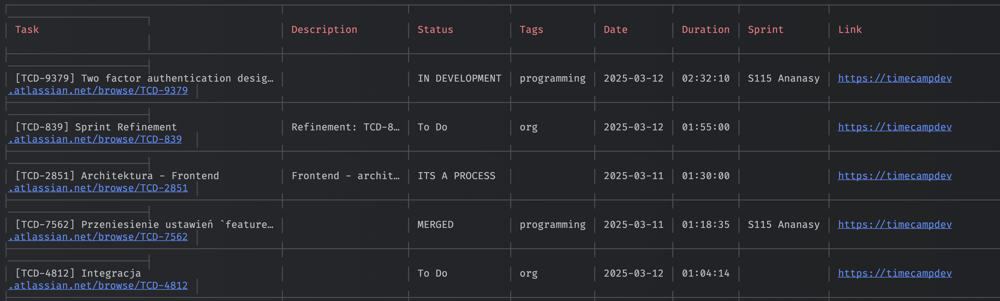

# 💡 How It Works

1. Retrieves time entries from TimeCamp
2. Matches entries with Jira issues
3. Generates a consolidated report
4. Handles weekend/Monday edge cases automatically

# 🚀 Getting Started
```shell
npm i -g @sebastiansiejek/daily-standup
daily-standup
```

## Browser
List data in browser.

- Sorting by any column
- Formatted link to a Jira issue
- Responsive design
```shell
daily-standup browser
```

## 🔧 Configuration
First-time setup will require:

- TimeCamp API key. You can get it from your [TimeCamp profile settings](https://app.timecamp.com/app#/settings/users/me)
- Jira credentials. You can get them from your [Jira account settings](https://id.atlassian.com/manage-profile/security/api-tokens)

### Reset config
```shell
daily-standup config:reset
```

# 🔐 Security
All credentials are saved locally on your machine.
